# USB crossfader curve prototype

This module replaces one firmware 1.19 crossfader lookup table in `rbp` memory.
It never writes the `rbp` file. A restart or power cycle restores the stock
table, and the other two selectable crossfader curves remain unchanged.

Place a file named `rx3-crossfader.json` at the root of the same USB drive as
the toolkit payload. The object may be pretty-printed and its fields may appear
in any order, but it must contain exactly these three fields:

```json
{
  "version": 1,
  "target": "mid",
  "points": [[0, 0], [0.5, 0.5], [1, 1]]
}
```

Two ready-to-copy examples live in [`examples`](examples):

- [`linear-center-dip.json`](examples/linear-center-dip.json) gives each deck
  0.5 gain at the physical center. Two uncorrelated signals then have 0.5
  combined power, or −3.01 dB relative to one deck at unity.
- [`equal-power.json`](examples/equal-power.json) approximates a square-root
  curve. Each deck is about 0.707 at the center, keeping combined power near
  unity for uncorrelated material.

Copy one to the root of the prepared drive and keep the required filename:

```sh
cp mod/modules/crossfader-curve/1.19/examples/linear-center-dip.json \
  /path/to/usb/rx3-crossfader.json
```

`target` selects the firmware table replaced behind one hardware selector
position: `mid` is the stock smooth position, `sharp` is the near-instant cut
position, and `mid-half` is the remaining transition position. `points`
contains 2 through 32 `[position, gain]` pairs. Position 0 is the muted far side
and position 1 is the full-gain near side. Both coordinates are linear values
from 0 through 1. The list must begin with `[0, 0]`, end with `[1, 1]`, use
strictly increasing positions, and never decrease in gain. The module linearly
interpolates gain between points into the firmware's 1,024-entry table. Decimal
coordinates may use at most nine digits after the decimal point so the USB
validator and preload consume exactly the same values.

Each deck remains capped at unity gain. A curve that keeps both sides loud near
the center can increase their summed level, just as the stock sharp curve does.

## Stock firmware responses

The firmware contains three 1,024-entry, single-deck gain tables. A table is
mirrored for the other deck across the physical crossfader travel. The first
chart follows the raw table index direction from audible to muted. JSON uses a
channel-relative direction: position 0 is muted and position 1 is full gain.
This reversal is intentional.

The overlap chart uses physical travel from Deck A at position 0 to Deck B at
position 1. Its orange line is `Deck A gain² + Deck B gain²`; the dashed line
marks unity power. This is the useful comparison for equally loud,
uncorrelated material. Correlated signals can sum differently according to
their phase and content. Stock `mid` stays close to unity at the center,
`sharp` runs both decks at unity for most of the travel and reaches roughly
+3.01 dB combined power, and `mid-half` leaves both decks silent at its exact
center.





The preload checks the complete stock table before changing memory. This
prototype supports only the verified firmware 1.19 `rbp` whose SHA-1 is
`cf309238491e73cdbdc1f08a09f7a3177e079068`. Missing configuration leaves a
stock session untouched. Invalid configuration aborts preparation before an
`rbp` restart or table change.

Select `crossfader-curve` when building the runtime. Configuration changes take
effect after the module restarts `rbp`; removing the configuration disables a
previously active preload on the next insertion.

## Build and test

The desktop app lists **USB crossfader curve (prototype)** in the Modules
installation tab. Select it, provide the extracted firmware 1.19 root
filesystem and key as usual, and write `autoexec.bin` to the USB drive.

The command-line equivalent is:

```sh
make autoexec \
  KEY=/path/outside/the/repository/aes256.key \
  MODULES="crossfader-curve logging"
```

`build/autoexec.bin` contains the ARM preload, validator, and runtime script.
Copy it and one example configuration to the root of the USB drive. `logging`
is optional, but useful while testing because it records the module's stock
table guard and activation result.

Run the focused contract suite and repository publication checks with:

```sh
python3 -m unittest tests.test_crossfader_curve
make preflight
```

Test custom curves at home and keep channel trims conservative. Removing
`rx3-crossfader.json` and reinserting the toolkit drive restarts `rbp` without
this preload. Powering off and removing `autoexec.bin` restores a completely
stock boot because the module only changes the running process's memory.
